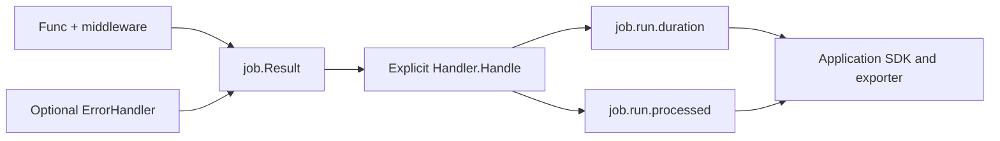

# oteljob

[](https://pkg.go.dev/github.com/uchaloop/oteljob) [](https://github.com/uchaloop/oteljob/actions/workflows/ci.yml) [](LICENSE)

Optional OpenTelemetry metrics for [job](https://github.com/uchaloop/job).
Two instruments measure completed attempts. No automatic logging, tracing,
exporter setup or network calls by the handler.

## Install

Requires Go 1.27 or later.

```sh
go get github.com/uchaloop/oteljob
```

## Use

Given an application-configured `metric.MeterProvider` named `provider`:

```go
observer, err := oteljob.MakeHandler(provider.Meter("example/orders-worker"))
if err != nil {
    return err
}
runner, err := job.MakeRunner(
    job.Config{Timeout: time.Minute},
    func(ctx context.Context) (int64, error) {
        return processBatch(ctx)
    },
)
if err != nil {
    return err
}
result := runner.Run(ctx)
observer.Handle(context.WithoutCancel(ctx), result)
```

Deliver each result once. `job.Runner` does not call an observer automatically.
Omit the observer entirely, implement `job.Handler` yourself, or combine sinks
with `job.MultiHandler`. Neither job nor beat imports OTel.

See [the executable example](example_test.go) for a complete SDK example.



## Metrics

| Instrument | Type / unit | Attributes |
|---|---|---|
| `job.run.duration` | Float64Histogram / `s` | `phase`, `outcome` |
| `job.run.processed` | Int64Histogram / `{item}` | `outcome` |

Duration phases:

| Phase | Measures | Outcome describes |
|---|---|---|
| `total` | Entire attempt, including error processing | Original work |
| `work` | Func and middleware | Original work |
| `error_handler` | Error processing, only when called | ErrorHandler itself |

Outcomes are `ok`, `error`, `panic`, `timeout`, `canceled`; unrecognized values
become `unknown`. Success is `outcome="ok"`; a separate numeric code would
repeat the same information. These outcomes do not represent process exit codes.
A successful DLQ callback does not change a failed work outcome.
The callback classifier recognizes wrapped/joined panic, deadline and cancellation
errors, then other errors; the original work uses `Result.Outcome` unchanged.

Count attempts using **duration count with `phase="total"`**. Counting all phases
would count the same attempt two or three times. Filter `outcome="panic"` for
recovered panics; no separate panic instrument is necessary.

The processed histogram includes zero and partial progress on failed attempts.
Its sum is reported processed items, its count is sampled attempts, and its
buckets describe batch sizes. Negative counts are omitted rather than turned
into empty batches. The library cannot verify application-reported counts.
Integer aggregation is int64; cumulative sums must remain within its range.

Results with zero `Start` are ignored: work never ran. An unrecovered panic or
blocked function has no completed result to observe. Timing excludes observation
handlers, scheduling waits, backoff and application startup/shutdown. Aggregated
metrics do not preserve a per-iteration history.

## Histograms

Default advisory boundaries:

- Duration, seconds: `0.005, 0.01, 0.025, 0.05, 0.1, 0.25, 0.5, 1, 2.5, 5, 10, 30, 60, 300, 600, 1800, 3600, 14400, 86400`.
- Processed items: `0, 1, 10, 50, 100, 250, 500, 750, 1000, 1500, 2500, 5000, 10000`.

The application can override these with SDK Views, including choosing a different
aggregation. Values above the last boundary enter the overflow bucket. Attributes
and histogram buckets both contribute to the number of exported time series.

## Service identity and export

The application configures the SDK Resource; the library adds no service or
infrastructure attributes. Suggested Resource fields are `service.name` and
`deployment.environment.name`, plus `k8s.cluster.name` and `k8s.namespace.name`
when applicable. Keep independent replicas distinguishable in the export pipeline.
Do not add error text, message IDs or iteration numbers as metric attributes.

Prometheus resource promotion is pipeline-specific: Resource fields do not
necessarily become labels on every series. Promote only the fields needed for
filtering. These metrics require neither logs nor traces.

For short-lived jobs, a scrape endpoint may disappear before it is scraped.
Use an application-configured OTLP exporter/Collector where appropriate, and
shut down the provider after recording the result, with a fresh bounded context.
A shutdown attempts to export buffered measurements; it does not guarantee backend
persistence. A ManualReader only collects when asked and does not send telemetry.

`rate`/`increase` need suitable samples of a time series. A single sample from
an ephemeral job does not provide a reliable execution count via `increase`.
Choose the collection and aggregation strategy for one-shot jobs accordingly.

## Environment configuration

Read telemetry identity from the standard OTel environment variables when the
application constructs its MeterProvider. The adapters consume that provider;
they do not read environment variables themselves. No separate configuration
library is needed for these values.

| Environment variable | Value |
| --- | --- |
| `OTEL_SERVICE_NAME` | Set to a stable service name, such as `daemon-efiro`. |
| `OTEL_RESOURCE_ATTRIBUTES` | Comma-separated `key=value` Resource attributes, as below. |

Recommended attributes inside `OTEL_RESOURCE_ATTRIBUTES`:

| Attribute | When to set it |
| --- | --- |
| `deployment.environment.name` | Local, staging or production environment. |
| `service.instance.id` | A unique identity for each concurrently running instance. |
| `k8s.namespace.name` | Kubernetes namespace; omit outside Kubernetes. |
| `k8s.cluster.name` | Kubernetes cluster name; omit outside Kubernetes. |

These are application identity conventions, not required configuration fields
of the handler. `OTEL_SERVICE_NAME` takes precedence over `service.name` inside
`OTEL_RESOURCE_ATTRIBUTES`. Set identity before constructing the provider;
changing the environment afterward does not refresh its Resource.

Local example (use a distinct instance ID for each concurrent process):

```sh
export OTEL_SERVICE_NAME=worker
export OTEL_RESOURCE_ATTRIBUTES='deployment.environment.name=local,service.instance.id=worker-local-1'
```

In Kubernetes, obtain the namespace (`metadata.namespace`) and Pod identity
(`metadata.uid`) through the
[Downward API](https://kubernetes.io/docs/tasks/inject-data-application/environment-variable-expose-pod-information/).
Supply the service name, deployment environment and cluster name through your
deployment configuration. To compose `OTEL_RESOURCE_ATTRIBUTES` from these values,
follow Kubernetes' official guide to
[dependent environment variables](https://kubernetes.io/docs/tasks/inject-data-application/define-interdependent-environment-variables/).

`resource.WithFromEnv()` reads these values. It does not configure an exporter.
Select a reader/exporter separately; exporter-specific environment variables
(such as an OTLP endpoint) only apply when that exporter is constructed.
Resource attributes also do not automatically become Prometheus labels: configure
selected Resource-to-label promotion in your exporter or Collector and preserve
distinct replica identity.

Read the Resource while constructing the provider in your application:

```go
import (
    "context"

    "go.opentelemetry.io/otel/sdk/resource"
    sdkmetric "go.opentelemetry.io/otel/sdk/metric"
)

func makeMeterProvider(reader sdkmetric.Reader) (*sdkmetric.MeterProvider, error) {
    res, err := resource.New(context.Background(), resource.WithFromEnv())
    if err != nil {
        return nil, err
    }
    return sdkmetric.NewMeterProvider(
        sdkmetric.WithResource(res),
        sdkmetric.WithReader(reader),
    ), nil
}
```

Pass a Meter from this provider to `MakeHandler`. The application owns provider
shutdown with a fresh, bounded context after work and observation finish.

## Grafana dashboard

[Job / CronJob dashboard](examples/grafana/job-cronjob.json) · [Setup and metric contract](examples/grafana/README.md)

Last-run Pushgateway snapshots and an optional Kubernetes lifecycle block. This example requires a separate snapshot publisher; MakeHandler alone does not produce its gauges.

## Uber Fx

Use [oteljobfx](https://github.com/uchaloop/oteljobfx) to provide a `job.Handler`
from your `metric.MeterProvider`. Call the handler explicitly after `Runner.Run`;
SDK configuration and shutdown remain application-owned.

## Acknowledgements

Built on [OpenTelemetry Go](https://github.com/open-telemetry/opentelemetry-go).
Thank you to its authors and maintainers for the instrumentation API and SDK.
